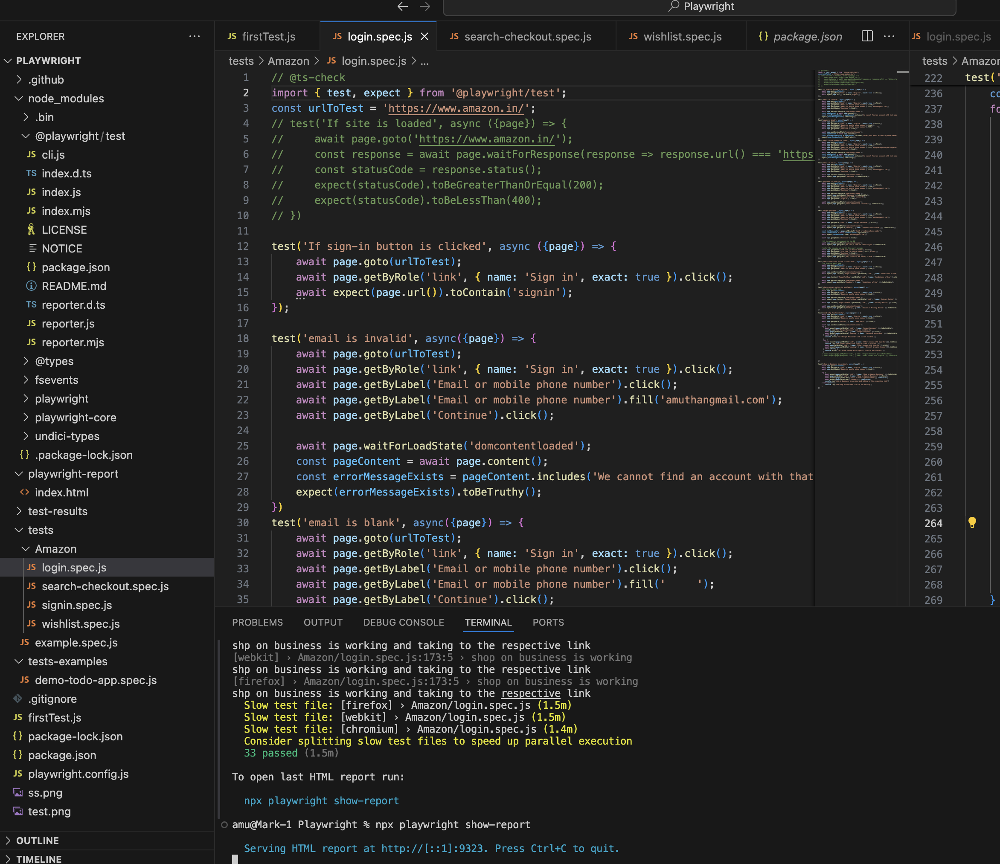

# amazon-playwright-automation
Covering the automation flow of login, product checkout, search functionality and wishlist functionality in amazon.in

This flow has validated the login process(already signed up), signin(if account is not there), search for a product, checkout that product or add that to the wishlist

## how to set it up

1. Take a clone/fork from the git-hub file
2. set-up the repository in your local machine 
3. To run playwright on your local machine, you'll nedd to set up a few necessary utilities:
    3.1. Node.js and npm: Playwright is a Node.js library, so you need to have Node.js installed on your machine. You can download and install Node.js from the official website: [Node.js Downloads. npm](https://nodejs.org/en/download) (Node Package Manager) comes bundled with Node.js.
    3.2. Playwright Package: Install the Playwright package in your project directory. You can do this using npm: ' npm install playwright '
    3.3. Browser Binaries: Playwright requires browser binaries to automate browser actions. When you install Playwright, it downloads the necessary browser binaries for Chromium, Firefox, and WebKit automatically. However, if you want to use a specific version or location for the browser binaries, you can set it up using environment variables or programmatically in your script.
    Once you have these utilities set up, you can start writing and running Playwright scripts locally on your machine

## how to run the code locally 

    npx playwright test -> runs all tests
    npx playwright test --workers 3 -> runs with 3 workers in parallel
    npx playwright test <filename.spec.js> -> runs a specific test file (npx playwright test tests/Amazon/login.spec.js , npx playwright test tests/Amazon/search-checkout.spec.js, npx playwright test tests/Amazon/signin.spec.js, npx playwright test tests/Amazon/wishlist.spec.js)
    npx playwright test -g "test name" -> run specific test in a file
    npx playwright test --headed -> runs in headed mode
    npx playwright test --debug -> allows to run the tests in the debug format, you can control the test steps
    npx playwright test --project=chromium -> runs on specific browser
    mpx playwright show-report -> shows the test report of the latest test run

    
    

## Manual UI test cases

    The following link has the test cases for the UI testing that is mentioned in the assignment
    Google sheet Link: [RTCamp-UI-testcases](https://docs.google.com/spreadsheets/d/1knNLaBH8TUL0Fb4VRHZQYAJwsSR969TT0tNSro-AwIo/edit?usp=sharing)

